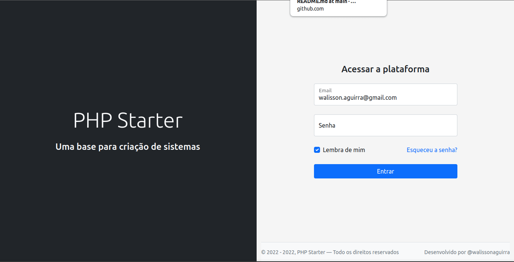

<h1 align="center"> 🚀 PHP Starter</h1>
<h3 align="center">Uma base para criação de sistemas.</h3>



<!-- ABOUT THE PROJECT -->
## Sobre o projeto
Este projeto foi idealizado e criado com a finalidade de documentar meu conhecimento atual em programação, irei atualizá lo constantemente conforme minha evolução como programador backend php

Fique avontade para clonar este repositório e analisa minhas implementação, **É compartilhado conhecimento que se aprende**

Este projeto busca seguir as boas práticas de programação de comunidade php [PHP Fig](https://www.php-fig.org/psr/) e [PHP do jeito certo](http://br.phptherightway.com/)

<p align="right">(<a href="#readme">volta ao topo</a>)</p>

## Construído com
- JavaScript Vanilla
- Bootstrap 5
- PHP 7.4
- POO (Programação Orientada a Objeto)
- Frontcontroller

<p align="right">(<a href="#readme">volta ao topo</a>)</p>

## Guia de instalação
1. Para começar você pode clonar esta projeto na sua máquina local usando o comando abaixo
```sh
git clone https://github.com/walissonaguirra/php-starter.git
```

2. Crie uma banco de dados com e nomeie como `php-starter`, você pode isso não variaveis de ambiente

3. Importe o banco de dados inicial `database.sql`

4. Estamos quase-lá, renomeie o arquivo `.env.example` para `.env`, aqui você pode alterar as variáveis de ambiente

5. Instala as dependências do projeto usando o comando
```sh
composer install
```

🎉 **Pronto!!!** você já pode acessar o seu _localhost_ e começa a codificar

<p align="right">(<a href="#readme">volta ao topo</a>)</p>

<!-- LICENSE -->
## License

Distribuído sob a licença MIT. Veja [LICENSE]() para mais informações.

<p align="right">(<a href="#readme">volta ao topo</a>)</p>


<!-- CONTACT -->
## Contato

<a href="mailto:walisson.aguirra@gmail.com"></a>
<a href="https://wa.me/5594984278097"></a>
<a href="https://www.linkedin.com/in/walissonaguirra"></a>
